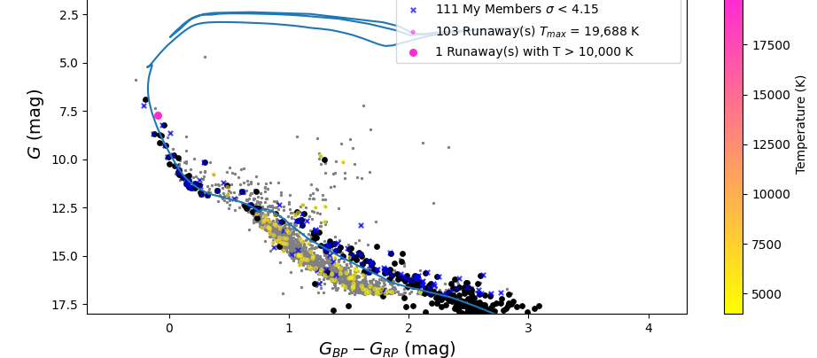

# Binary Supernova Ejected Runaway Stars Code
Sample Color-Magnitude Diagram



# Demo
## Part 0: Import necessary libraries
Import the functions necessary for the code:

```python
%run runaway_functionsv2
%matplotlib qt
```

This also imports a list of young open clusters from (based on Dias+ 2021, Gaia DR2):
```python
display(cluster_list)
```
<div><i>Table length=399</i>
<table id="table1978026515312" class="table-striped table-bordered table-condensed">
<thead><tr><th>Cluster</th><th>RA_ICRS</th><th>DE_ICRS</th><th>r50</th><th>Diameter</th><th>r50_table2</th><th>N</th><th>pmRA</th><th>e_pmRA</th><th>pmDE</th><th>e_pmDE</th><th>Plx</th><th>e_Plx</th><th>RV</th><th>e_RV</th><th>NRV</th><th>Dist</th><th>e_Dist</th><th>logage</th><th>e_logage</th><th>__Fe_H_</th><th>e__Fe_H_</th><th>Av</th><th>e_Av</th><th>FileName</th><th>SimbadName</th><th>_RA.icrs</th><th>_DE.icrs</th></tr></thead>
<thead><tr><th></th><th>deg</th><th>deg</th><th>deg</th><th></th><th></th><th></th><th>mas / yr</th><th>mas / yr</th><th>mas / yr</th><th>mas / yr</th><th>mas</th><th>mas</th><th>km / s</th><th>km / s</th><th></th><th>pc</th><th>pc</th><th>log(yr)</th><th>log(yr)</th><th></th><th></th><th>mag</th><th>mag</th><th></th><th></th><th>deg</th><th>deg</th></tr></thead>
<thead><tr><th>str16</th><th>float64</th><th>float64</th><th>float32</th><th>float64</th><th>float64</th><th>int16</th><th>float32</th><th>float32</th><th>float32</th><th>float32</th><th>float32</th><th>float32</th><th>float64</th><th>float32</th><th>int16</th><th>int16</th><th>int16</th><th>float32</th><th>float32</th><th>float32</th><th>float32</th><th>float32</th><th>float32</th><th>str30</th><th>str31</th><th>float64</th><th>float64</th></tr></thead>
<tr><td>ASCC_107</td><td>297.1623</td><td>22.0071</td><td>0.156</td><td>20.88</td><td>0.174</td><td>59</td><td>-0.144</td><td>0.135</td><td>-5.158</td><td>0.141</td><td>1.118</td><td>0.055</td><td>--</td><td>--</td><td>--</td><td>864</td><td>30</td><td>7.440</td><td>0.121</td><td>0.353</td><td>0.103</td><td>1.372</td><td>0.129</td><td>clusters1/ASCC_107.dat</td><td>[KPR2005] 107</td><td>297.1623</td><td>22.0071</td></tr>
<tr><td>ASCC_114</td><td>324.9790</td><td>53.9990</td><td>0.180</td><td>25.92</td><td>0.216</td><td>149</td><td>-3.754</td><td>0.210</td><td>-3.435</td><td>0.145</td><td>1.063</td><td>0.039</td><td>--</td><td>--</td><td>--</td><td>911</td><td>12</td><td>7.632</td><td>0.271</td><td>0.035</td><td>0.078</td><td>1.216</td><td>0.091</td><td>clusters1/ASCC_114.dat</td><td>[KPR2005] 114</td><td>324.9790</td><td>53.9990</td></tr>
<tr><td>ASCC_127</td><td>347.1807</td><td>64.9151</td><td>0.541</td><td>75.24</td><td>0.627</td><td>113</td><td>7.490</td><td>0.261</td><td>-1.781</td><td>0.319</td><td>2.618</td><td>0.080</td><td>-11.267</td><td>2.676</td><td>16</td><td>365</td><td>10</td><td>7.496</td><td>0.131</td><td>0.152</td><td>0.115</td><td>0.668</td><td>0.080</td><td>clusters1/ASCC_127.dat</td><td>[KPR2005] 127</td><td>347.1806</td><td>64.9151</td></tr>
<tr><td>ASCC_13</td><td>78.3057</td><td>44.4212</td><td>0.564</td><td>73.08</td><td>0.609</td><td>110</td><td>-0.477</td><td>0.111</td><td>-1.737</td><td>0.108</td><td>0.899</td><td>0.076</td><td>--</td><td>--</td><td>--</td><td>1066</td><td>26</td><td>7.615</td><td>0.098</td><td>-0.075</td><td>0.078</td><td>0.915</td><td>0.027</td><td>clusters1/ASCC_13.dat</td><td>[KPR2005] 13</td><td>78.3057</td><td>44.4212</td></tr>
<tr><td>ASCC_16</td><td>81.2025</td><td>1.6256</td><td>0.367</td><td>45.12</td><td>0.376</td><td>207</td><td>1.363</td><td>0.280</td><td>0.002</td><td>0.274</td><td>2.844</td><td>0.113</td><td>21.308</td><td>1.696</td><td>12</td><td>348</td><td>3</td><td>7.088</td><td>0.061</td><td>-0.062</td><td>0.069</td><td>0.224</td><td>0.045</td><td>clusters1/ASCC_16.dat</td><td>[KPR2005] 16</td><td>81.2025</td><td>1.6256</td></tr>
<tr><td>ASCC_19</td><td>82.0035</td><td>-1.9617</td><td>0.613</td><td>72.6</td><td>0.605</td><td>173</td><td>1.112</td><td>0.263</td><td>-1.303</td><td>0.241</td><td>2.756</td><td>0.088</td><td>23.576</td><td>2.719</td><td>10</td><td>356</td><td>2</td><td>7.139</td><td>0.030</td><td>0.076</td><td>0.077</td><td>0.189</td><td>0.043</td><td>clusters1/ASCC_19.dat</td><td>[KPR2005] 19</td><td>82.0035</td><td>-1.9617</td></tr>
<tr><td>ASCC_21</td><td>82.1423</td><td>3.4771</td><td>0.419</td><td>49.2</td><td>0.41</td><td>102</td><td>1.381</td><td>0.292</td><td>-0.610</td><td>0.237</td><td>2.893</td><td>0.132</td><td>15.313</td><td>3.818</td><td>8</td><td>343</td><td>5</td><td>7.102</td><td>0.038</td><td>-0.008</td><td>0.029</td><td>0.236</td><td>0.048</td><td>clusters1/ASCC_21.dat</td><td>[KPR2005] 21</td><td>82.1423</td><td>3.4771</td></tr>
<tr><td>ASCC_32</td><td>105.7112</td><td>-26.5758</td><td>0.646</td><td>78.72</td><td>0.656</td><td>255</td><td>-3.317</td><td>0.232</td><td>3.475</td><td>0.126</td><td>1.240</td><td>0.067</td><td>34.607</td><td>4.624</td><td>10</td><td>792</td><td>11</td><td>7.432</td><td>0.022</td><td>-0.003</td><td>0.048</td><td>0.220</td><td>0.019</td><td>clusters1/ASCC_32.dat</td><td>[KPR2005] 32</td><td>105.7112</td><td>-26.5758</td></tr>
<tr><td>ASCC_67</td><td>175.2892</td><td>-60.9906</td><td>0.165</td><td>21.96</td><td>0.183</td><td>46</td><td>-6.775</td><td>0.064</td><td>0.925</td><td>0.059</td><td>0.482</td><td>0.026</td><td>--</td><td>--</td><td>--</td><td>1921</td><td>89</td><td>7.483</td><td>0.227</td><td>0.215</td><td>0.095</td><td>0.810</td><td>0.044</td><td>clusters1/ASCC_67.dat</td><td>[KPR2005] 67</td><td>175.2893</td><td>-60.9906</td></tr>
<tr><td>...</td><td>...</td><td>...</td><td>...</td><td>...</td><td>...</td><td>...</td><td>...</td><td>...</td><td>...</td><td>...</td><td>...</td><td>...</td><td>...</td><td>...</td><td>...</td><td>...</td><td>...</td><td>...</td><td>...</td><td>...</td><td>...</td><td>...</td><td>...</td><td>...</td><td>...</td><td>...</td><td>...</td></tr>
<tr><td>UPK_540</td><td>114.5354</td><td>-58.4348</td><td>0.766</td><td>98.64</td><td>0.822</td><td>48</td><td>-4.815</td><td>0.212</td><td>7.661</td><td>0.210</td><td>2.663</td><td>0.097</td><td>14.456</td><td>3.188</td><td>3</td><td>365</td><td>4</td><td>7.513</td><td>0.043</td><td>-0.008</td><td>0.070</td><td>0.448</td><td>0.071</td><td>clusters1/UPK_540.dat</td><td>UPK 540</td><td>114.5354</td><td>-58.4348</td></tr>
<tr><td>UPK_604</td><td>224.3164</td><td>-59.8095</td><td>0.260</td><td>42.36</td><td>0.353</td><td>43</td><td>-4.548</td><td>0.144</td><td>-3.711</td><td>0.199</td><td>1.307</td><td>0.079</td><td>--</td><td>--</td><td>--</td><td>745</td><td>9</td><td>7.113</td><td>0.492</td><td>-0.209</td><td>0.314</td><td>1.773</td><td>0.417</td><td>clusters1/UPK_604.dat</td><td>UPK 604</td><td>224.3164</td><td>-59.8095</td></tr>
<tr><td>UPK_606</td><td>216.1298</td><td>-46.3629</td><td>0.716</td><td>93.84</td><td>0.782</td><td>46</td><td>-20.147</td><td>0.688</td><td>-16.551</td><td>0.686</td><td>5.882</td><td>0.184</td><td>10.435</td><td>2.725</td><td>7</td><td>167</td><td>2</td><td>7.231</td><td>0.142</td><td>-0.052</td><td>0.175</td><td>0.133</td><td>0.284</td><td>clusters1/UPK_606.dat</td><td>UPK 606</td><td>216.1299</td><td>-46.3628</td></tr>
<tr><td>UPK_62</td><td>289.7268</td><td>20.8263</td><td>0.110</td><td>13.92</td><td>0.116</td><td>33</td><td>-0.452</td><td>0.111</td><td>-5.418</td><td>0.128</td><td>1.075</td><td>0.056</td><td>--</td><td>--</td><td>--</td><td>885</td><td>21</td><td>7.039</td><td>0.246</td><td>0.021</td><td>0.254</td><td>3.421</td><td>0.257</td><td>clusters1/UPK_62.dat</td><td>UPK 62</td><td>289.7268</td><td>20.8263</td></tr>
<tr><td>UPK_621</td><td>237.1990</td><td>-54.3853</td><td>0.425</td><td>56.52</td><td>0.471</td><td>57</td><td>-2.471</td><td>0.150</td><td>-3.101</td><td>0.100</td><td>1.126</td><td>0.058</td><td>--</td><td>--</td><td>--</td><td>878</td><td>32</td><td>7.559</td><td>0.229</td><td>0.150</td><td>0.134</td><td>0.942</td><td>0.206</td><td>clusters1/UPK_621.dat</td><td>UPK 621</td><td>237.1990</td><td>-54.3853</td></tr>
<tr><td>UPK_640</td><td>250.4137</td><td>-39.5740</td><td>1.231</td><td>163.32</td><td>1.361</td><td>540</td><td>-12.014</td><td>0.917</td><td>-21.350</td><td>0.779</td><td>5.666</td><td>0.239</td><td>1.174</td><td>2.002</td><td>50</td><td>173</td><td>1</td><td>7.379</td><td>0.091</td><td>0.149</td><td>0.102</td><td>0.189</td><td>0.101</td><td>clusters1/UPK_640.dat</td><td>UPK 640</td><td>250.4138</td><td>-39.5739</td></tr>
<tr><td>vdBergh_130</td><td>304.4624</td><td>39.3404</td><td>0.049</td><td>5.88</td><td>nan</td><td>62</td><td>-3.609</td><td>0.308</td><td>-5.075</td><td>0.292</td><td>0.521</td><td>0.154</td><td>--</td><td>--</td><td>--</td><td>1456</td><td>240</td><td>6.974</td><td>0.091</td><td>-0.029</td><td>0.163</td><td>2.356</td><td>0.042</td><td>clusters2/vdBergh_130.dat</td><td>Cl VDB 130</td><td>304.4624</td><td>39.3404</td></tr>
<tr><td>vdBergh_80</td><td>97.7471</td><td>-9.6215</td><td>0.151</td><td>17.16</td><td>0.143</td><td>60</td><td>-3.285</td><td>0.430</td><td>0.481</td><td>0.361</td><td>1.026</td><td>0.112</td><td>--</td><td>--</td><td>--</td><td>947</td><td>2</td><td>6.790</td><td>0.046</td><td>-0.148</td><td>0.091</td><td>1.726</td><td>0.219</td><td>clusters1/vdBergh_80.dat</td><td>Cl VDB 80</td><td>97.7471</td><td>-9.6215</td></tr>
<tr><td>vdBergh_85</td><td>101.7288</td><td>1.3329</td><td>0.045</td><td>4.8</td><td>0.04</td><td>29</td><td>-0.973</td><td>0.147</td><td>0.345</td><td>0.164</td><td>0.550</td><td>0.049</td><td>--</td><td>--</td><td>--</td><td>1720</td><td>167</td><td>7.104</td><td>0.125</td><td>-0.055</td><td>0.124</td><td>1.206</td><td>0.270</td><td>clusters1/vdBergh_85.dat</td><td>Cl VDB 85</td><td>101.7288</td><td>1.3329</td></tr>
<tr><td>vdBergh_92</td><td>106.0426</td><td>-11.4884</td><td>0.114</td><td>13.44</td><td>0.112</td><td>154</td><td>-4.539</td><td>0.219</td><td>1.607</td><td>0.211</td><td>0.834</td><td>0.091</td><td>27.580</td><td>6.680</td><td>2</td><td>1114</td><td>42</td><td>6.749</td><td>0.074</td><td>0.025</td><td>0.087</td><td>0.984</td><td>0.062</td><td>clusters1/vdBergh_92.dat</td><td>Cl VDB 92</td><td>106.0426</td><td>-11.4884</td></tr>
</table></div>

# Part 1: Obtain the cluster class object

using the `get_cluster` function from the `runaway_functions.py`, with the `cluster_name` as the input, we obtain the parameters of the cluster.

example usage:
```python
cluster_name = 'ASCC_21'
import os
from astropy.table import Table, Column
from runaway_functions import get_cluster
cluster = get_cluster(cluster_name)
display(cluster)
```

This imports all the details for the cluster.
Various parameters of the cluster can be accessed:
- Name
- Diameter (r50 Diameter: Diameter within which 50% of the cluster members lie)
- Number of Cluster members etc.
All parameters can be accessed together by:

```python
cluster_name = 'ASCC_21'
cluster = Cluster(cluster_name)
cluster.all
```
<i>Row index=0</i>
<table id="table2364314290064">
<thead><tr><th>Cluster</th><th>RA_ICRS</th><th>DE_ICRS</th><th>r50</th><th>Diameter</th><th>r50_table2</th><th>N</th><th>pmRA</th><th>e_pmRA</th><th>pmDE</th><th>e_pmDE</th><th>Plx</th><th>e_Plx</th><th>RV</th><th>e_RV</th><th>NRV</th><th>Dist</th><th>e_Dist</th><th>logage</th><th>e_logage</th><th>__Fe_H_</th><th>e__Fe_H_</th><th>Av</th><th>e_Av</th><th>FileName</th><th>SimbadName</th><th>_RA.icrs</th><th>_DE.icrs</th></tr></thead>
<thead><tr><th></th><th>deg</th><th>deg</th><th>deg</th><th></th><th></th><th></th><th>mas / yr</th><th>mas / yr</th><th>mas / yr</th><th>mas / yr</th><th>mas</th><th>mas</th><th>km / s</th><th>km / s</th><th></th><th>pc</th><th>pc</th><th>log(yr)</th><th>log(yr)</th><th></th><th></th><th>mag</th><th>mag</th><th></th><th></th><th>deg</th><th>deg</th></tr></thead>
<thead><tr><th>str16</th><th>float64</th><th>float64</th><th>float32</th><th>float64</th><th>float64</th><th>int16</th><th>float32</th><th>float32</th><th>float32</th><th>float32</th><th>float32</th><th>float32</th><th>float64</th><th>float32</th><th>int16</th><th>int16</th><th>int16</th><th>float32</th><th>float32</th><th>float32</th><th>float32</th><th>float32</th><th>float32</th><th>str30</th><th>str31</th><th>float64</th><th>float64</th></tr></thead>
<tr><td>ASCC_21</td><td>82.1423</td><td>3.4771</td><td>0.419</td><td>49.2</td><td>0.41</td><td>102</td><td>1.381</td><td>0.292</td><td>-0.610</td><td>0.237</td><td>2.893</td><td>0.132</td><td>15.313</td><td>3.818</td><td>8</td><td>343</td><td>5</td><td>7.102</td><td>0.038</td><td>-0.008</td><td>0.029</td><td>0.236</td><td>0.048</td><td>clusters1/ASCC_21.dat</td><td>[KPR2005] 21</td><td>82.1423</td><td>3.4771</td></tr>
</table>

## Part 2: Search stars in a region around the cluster

Using the `calculate_search_arcmin` function from runaway_functions, calculate the region to be searched around the cluster. by default it is $10\ \mathrm{pc}$ around the clusters (from the edge of the cluster). This returns an astropy quantity object and prints its value.

```python
cluster.calculate_search_arcmin()
```
$124.771  \mathrm{{}^{\prime}}$

We can also visualize this search region using:

```python
cluster.plot_search_region()
```


Using this as the search radius for a conic search around the cluster center coordinates, we find a table of all the stars in the cone.

## Getting runaways (all functions necessary included):
```python
cluster = Cluster('Ruprecht_170')
cluster.generate_tables()
theoretical_data = theoretical_isochrone(cluster,output="table",printing=False)
fs = cluster.read_table('fs')
runaways = get_runaways(cluster,fs,theoretical_data)
display(runaways)
```

